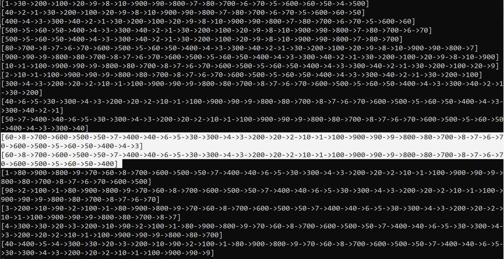
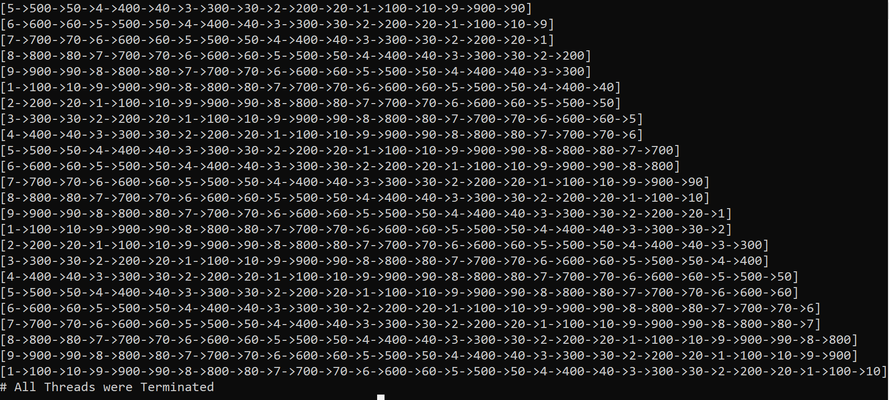

# 결과 분석

## 1. Wait On Address 방식

Wait on Address 방식으로 block되는 경우이다.
이 때, 파일 출력을 위해 S키를 연타하였을 때 위와 같이 data insert가 지연되는 경우를 볼 수 있다.

## 2. Event 방식
 

Event 방식으로 block되는 경우이다.

Wait on Address 방식에 비해 확실히 data를 삽입하는 스레드들의 순서가 규칙적으로 분배되고 있음을 볼 수 있다.